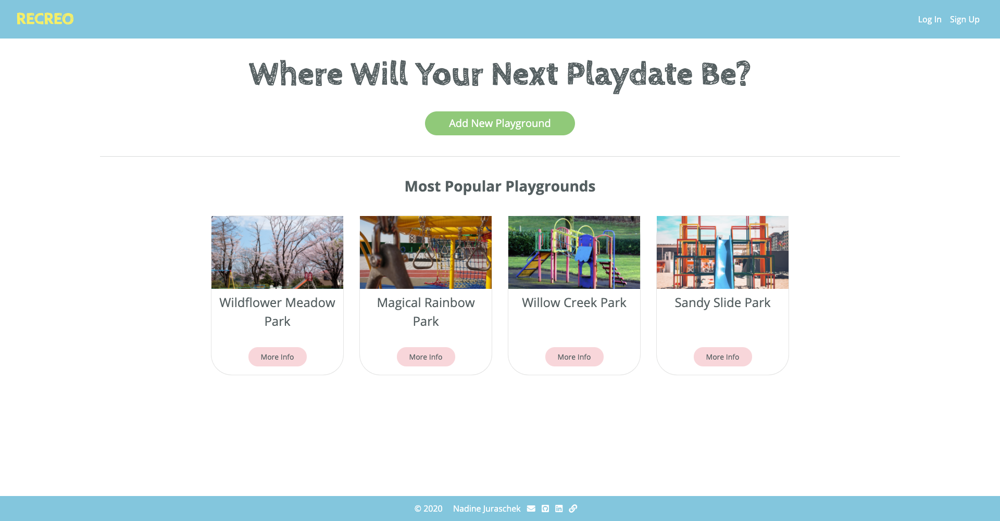
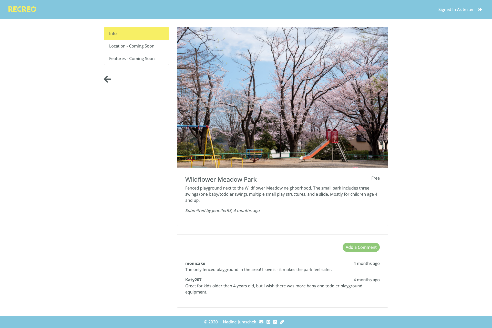
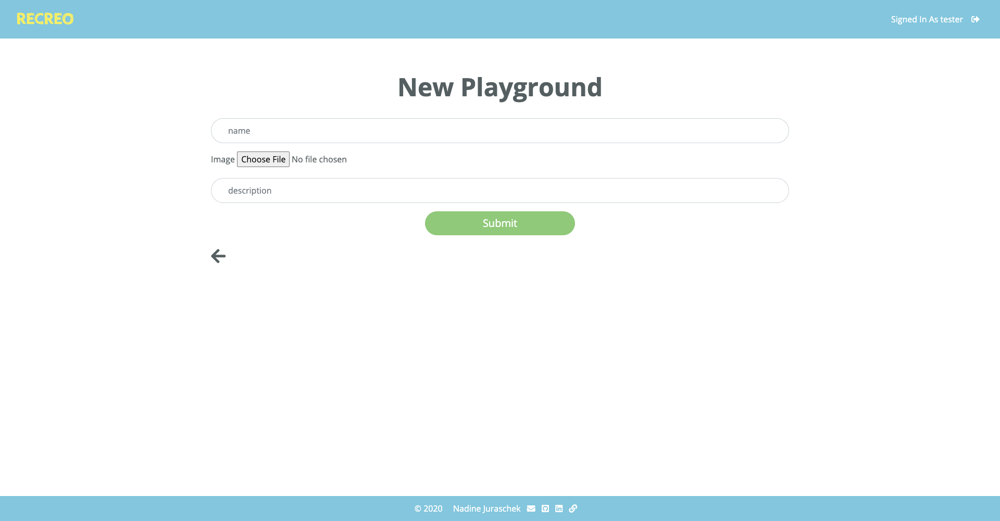
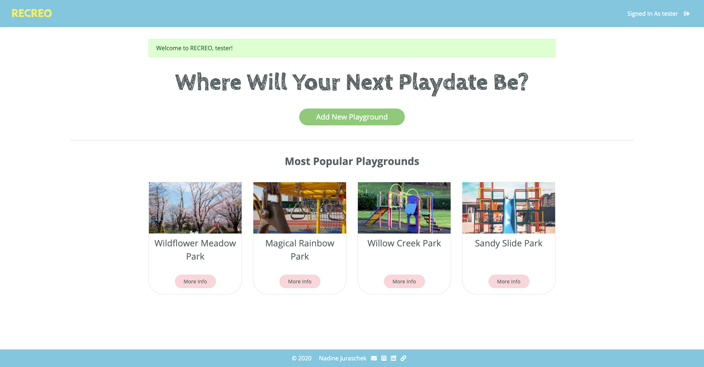

# RECREO
## Find Your Next Playtime Location
by browsing playgrounds and parks in your area and finding helpful information about their equipment and amenities.

##### Live Demo
Visit [Recreo](https://recreo-findaplayground.herokuapp.com/).

##### Test Login Credentials
* username: tester
* password: testing2020

### Motivation
There are various applications that make it easier to find good hotels or restaurants near you. They display pricing, noise levels, amenities, etc. for adults to find a great spot to work at, stay at, or dine out. But what about our kids? Imagine you take your kids out for a playdate at a park you found online, but when you're there you realize that the playground equipment isn't safe for your toddlers or not exciting enough for your older kids.

### Project Goals
The goal is to create an app that lets users add playgrounds with images and helpful descriptions for other caretakers. Locations can be rated and commented on.

### Current Features
* User Login:
    * Add a playground
    * Leave comments on any playground
    * Removing and editing a playground only if it has been created by the logged in user
* Browse playgrounds
* Success and error notifications when adding/removing/editing a playground, commenting, or logging in/registering

### Technologies
* JavaScript
* Bootstrap
* Node.js
    * dotenv
    * express
    * express-session
    * ejs
    * methodOverride
    * mongoose
    * passport-local
    * connect-flash
    * moment
    * cloudinary
    * multer
* mongoDB

### Preview
##### Landing Page with Background Animation

##### All Playgrounds

##### Single Playground View

##### Add a Playground

##### Notifications

### Future Development Goals
* location and maps view
* opening/operation hours
* features for each playground (e.g. 'Toddler Equipment', 'Restrooms', 'Picnic Area', etc.)
* user profile and admin role
* ratings
* forgot password? link to reset password
* image upload
* more notifications